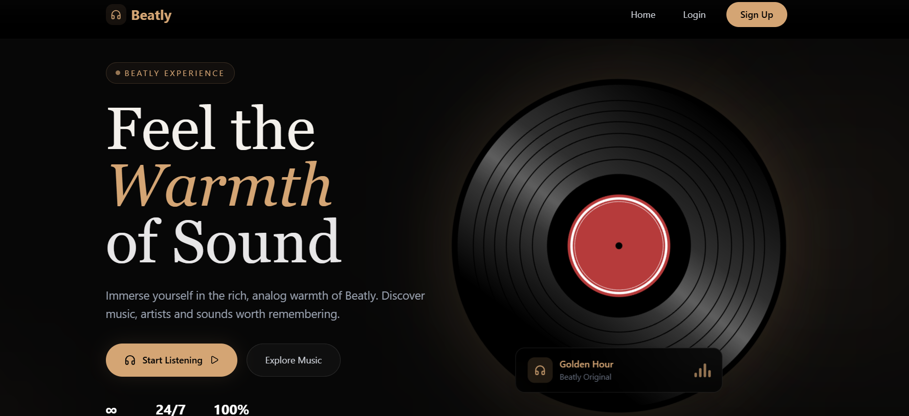
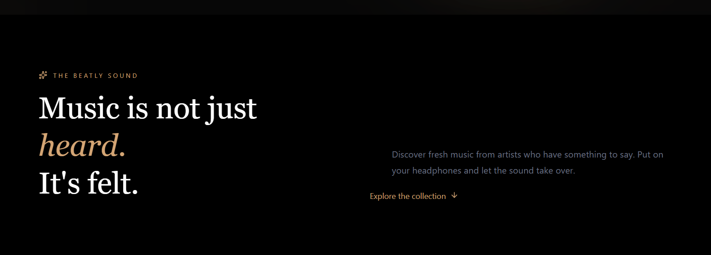
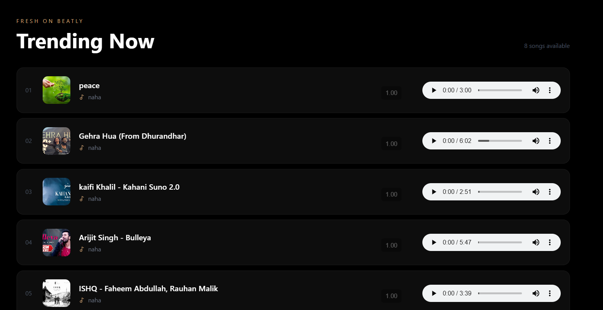
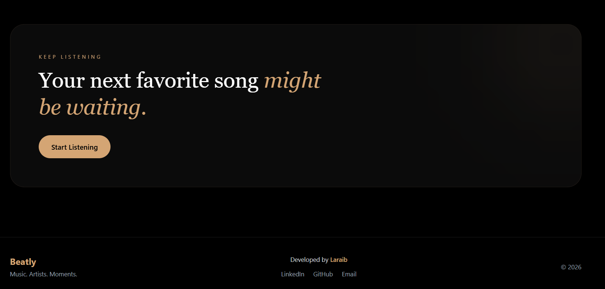
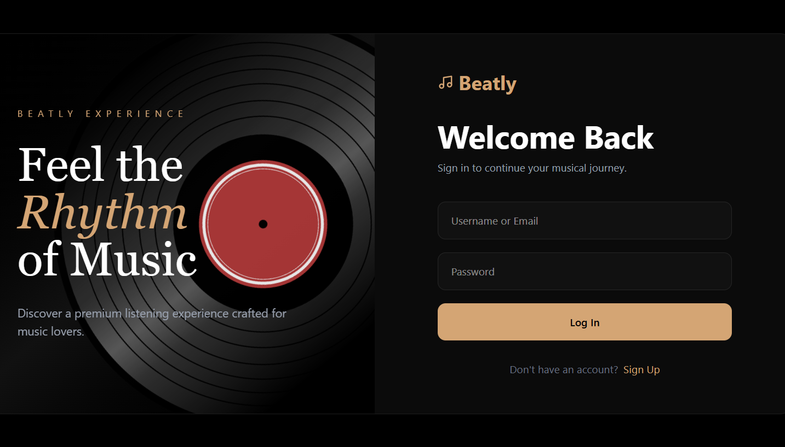
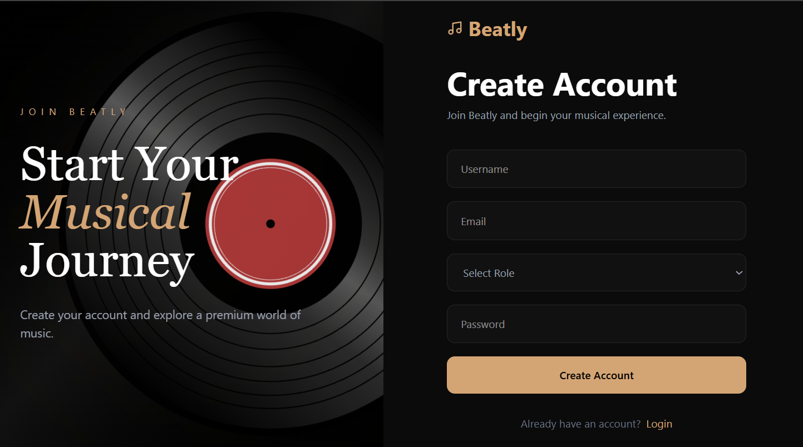
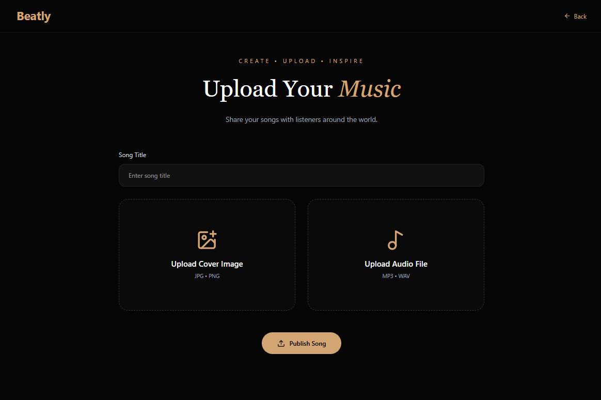

# 🎵 Beatly — Full-Stack Music Streaming Platform

> A modern full-stack music streaming platform where artists can upload and manage their music while listeners can discover and enjoy songs through a clean, responsive interface.

---

## 🌐 Overview

**Beatly** is a full-stack music streaming web application built to connect artists and listeners on one platform.

Artists can create an account, upload their music with cover artwork, manage their uploaded songs, and listen to their own releases.

Users can explore available music, discover new songs, and stream music directly from the platform.

The project was built from scratch with a focus on **modern UI, authentication, REST APIs, database integration, media uploads, and real-world frontend/backend communication.**

---

## ✨ Features

### 🎧 Music Discovery

- Browse available songs
- View trending/latest uploads
- Search music by title
- Stream songs directly in the browser
- Display song cover artwork and artist information

### 🎤 Artist Features

- Artist registration and login
- Protected artist dashboard
- Upload music
- Upload cover artwork
- View personal uploaded songs
- Search uploaded songs
- Play uploaded music
- Delete uploaded music
- View total uploaded songs

### 👤 User Features

- User authentication
- User dashboard
- Browse available music
- Discover songs uploaded by artists
- Stream music

### 🔐 Authentication & Security

- JWT-based authentication
- Protected routes
- Artist-only authorization
- Password hashing with bcrypt
- Token-based API authentication

### ☁️ Media Management

- Music files uploaded to ImageKit
- Cover images stored using ImageKit
- Image URLs stored in MongoDB
- Audio streamed directly from uploaded media

### 📱 UI & Experience

- Responsive design
- Mobile-friendly layouts
- Modern dark music-themed interface
- Smooth transitions and hover effects
- Search functionality
- Audio player controls

---

# 🛠️ Tech Stack

## Frontend

| Technology | Purpose |
|------------|---------|
| React | User interface |
| Vite | Frontend development/build tool |
| Tailwind CSS | Styling |
| Lucide React | Icons |
| React Router | Client-side routing |
| JavaScript | Application logic |

## Backend

| Technology | Purpose |
|------------|---------|
| Node.js | Runtime environment |
| Express.js | REST API |
| MongoDB | Database |
| Mongoose | MongoDB ODM |
| JWT | Authentication |
| bcryptjs | Password hashing |

## External Services

| Service | Purpose |
|---------|---------|
| ImageKit | Music and cover image storage |

---

# 📸 Screenshots

## 🏠 Home Page

The Beatly home page introduces the platform and displays the latest/trending music available for listeners.






---

## 🔐 Login

Users and artists can securely log into their accounts using their credentials.



---

## 📝 Signup

New users and artists can create their Beatly accounts.



---

## 🎤 Artist Dashboard

The artist dashboard allows artists to manage their music and view their uploaded songs.


---

## 📤 Upload Music

Artists can upload a song together with its cover artwork.



---

## 🎧 Artist Music Library

Artists can view, search, play, and manage their uploaded music.


---

## 👤 User Dashboard

Listeners can access their dashboard and discover music available on Beatly.


---

# 🔄 How Beatly Works

## 🎤 Artist Flow

```text
Artist
   ↓
Signup / Login
   ↓
JWT Authentication
   ↓
Artist Dashboard
   ↓
Upload Music
   ↓
ImageKit
   ↓
Music URL + Cover URL
   ↓
MongoDB
   ↓
Music Available on Beatly


